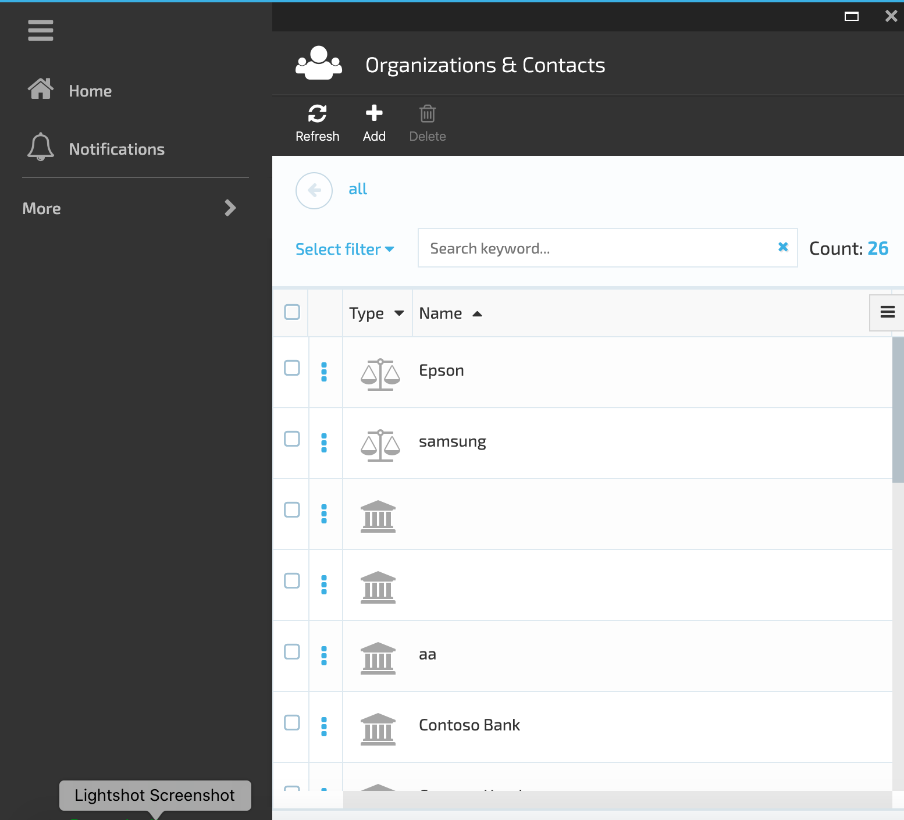

# VirtoCommerce.Customer

VirtoCommerce.Customer module represents contacts management system. The main purpose of this functionality is to keep the users contact information. The VC Customer Module helps to view, search and edit contact information.

**Key features**:

1. Сontacts arrangement in hierarchical structure;
1. Module extensibility with custom contact types;
1. "Organization", "Employee", "Customer" and "Vendor" contact types supported out of the box.

 **Contact Types**:

1. Organization;
1. Employee;
1. Contact;
1. Vendor.

## Organization

Organization contact type is a container for other Organizations and Customers.

[View Organization Details](/docs/view-organization-details.md)

[Create And Manage Organization](/docs/create-and-manage-organization.md)

## Employee

Employee contact type means the Organization Employee.

[Create And Manage Employee](/docs/create-and-manage-employee.md)

## Contact

 A Contact is the Shop customer. It can belong to Organizations or represent an individual shopper.

[Create And Manage Contacts](/docs/manage-contacts.md)

## Vendor

Vendor contact type is the Shop Vendor.

[Create And Manage Vendors](/docs/manage-vendors.md)

## Advanced Filter

[Advanced Filter](/docs/advanced-filter.md)

## Documentation

Developer guide: <a href="https://virtocommerce.com/docs/vc2devguide/extending-commerce/extending-members-domain-types" target="_blank">Extending Members domain types</a>

## Installation

Installing the module:
* Automatically: in VC Manager go to Configuration -> Modules -> Customer management module -> Install
* Manually: download module zip package from https://github.com/VirtoCommerce/vc-module-customer/releases. In VC Manager go to Configuration -> Modules -> Advanced -> upload module package -> Install.

## Available resources

* Module related service implementations as a <a href="https://www.nuget.org/packages/VirtoCommerce.CustomerModule.Data" target="_blank">NuGet package</a>
* API client as a <a href="https://www.nuget.org/packages/VirtoCommerce.CustomerModule.Client" target="_blank">NuGet package</a>
* API client documentation http://demo.virtocommerce.com/admin/docs/ui/index#!/Customer_management_module

## License

Copyright (c) Virto Solutions LTD.  All rights reserved.

Licensed under the Virto Commerce Open Software License (the "License"); you
may not use this file except in compliance with the License. You may
obtain a copy of the License at

http://virtocommerce.com/opensourcelicense

Unless required by applicable law or agreed to in writing, software
distributed under the License is distributed on an "AS IS" BASIS,
WITHOUT WARRANTIES OR CONDITIONS OF ANY KIND, either express or
implied.
