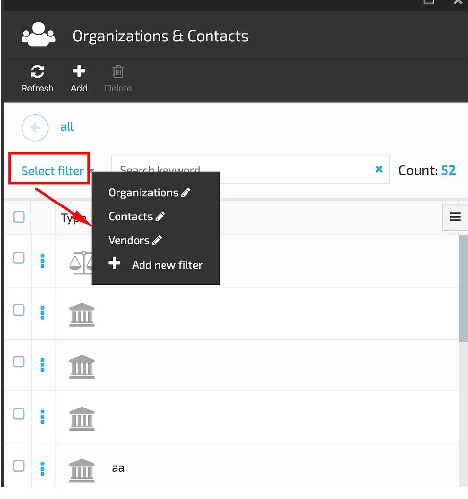
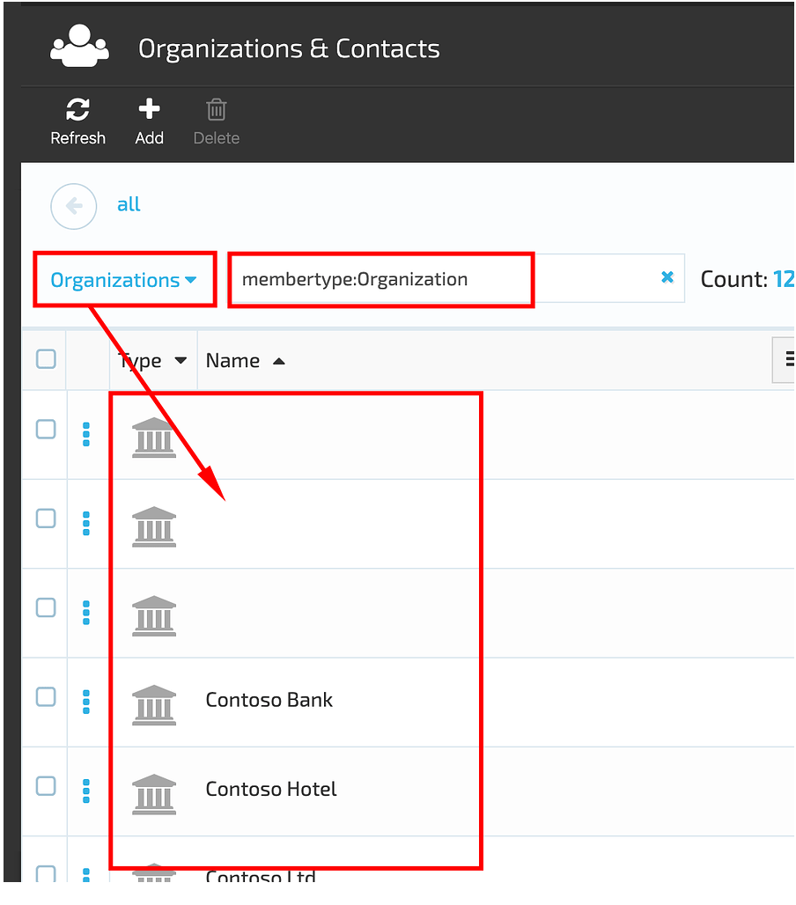
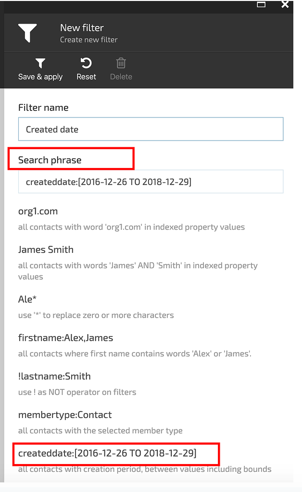
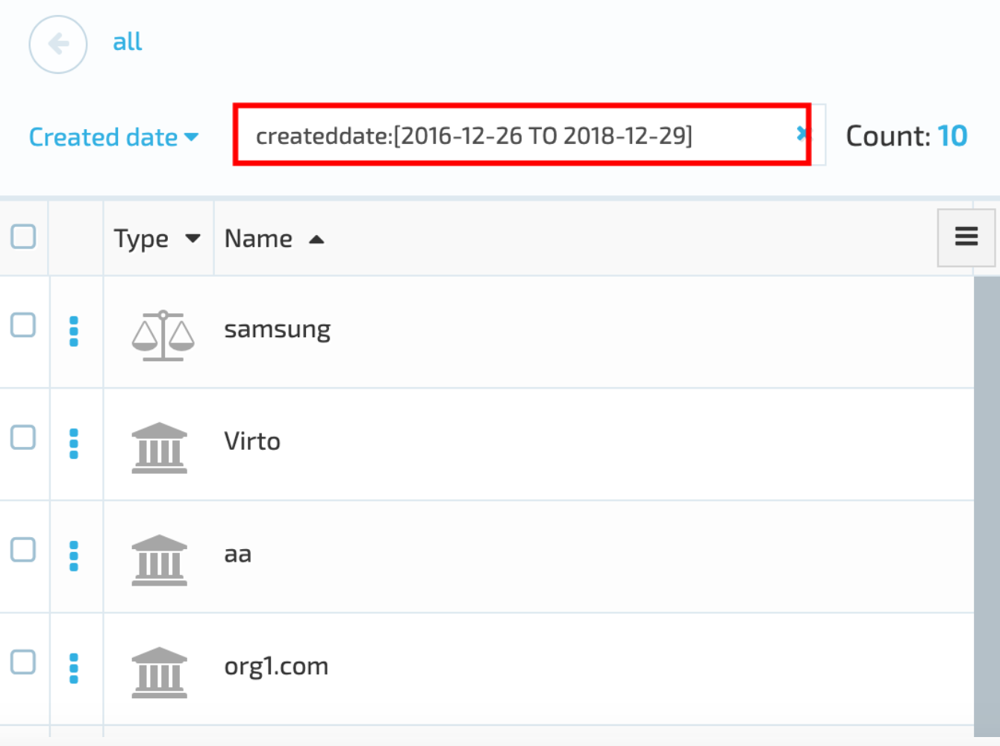
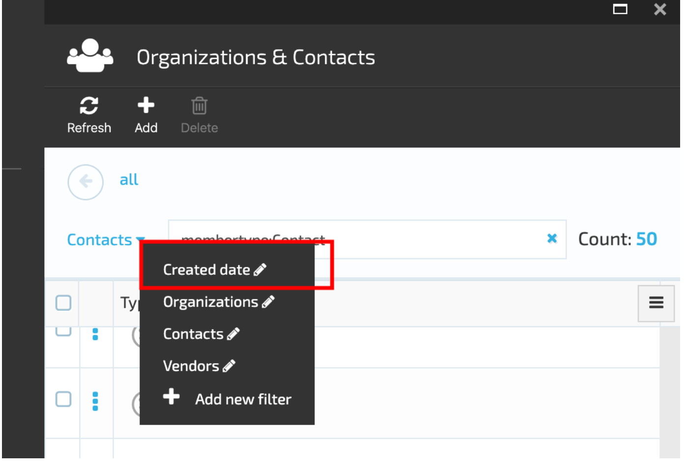
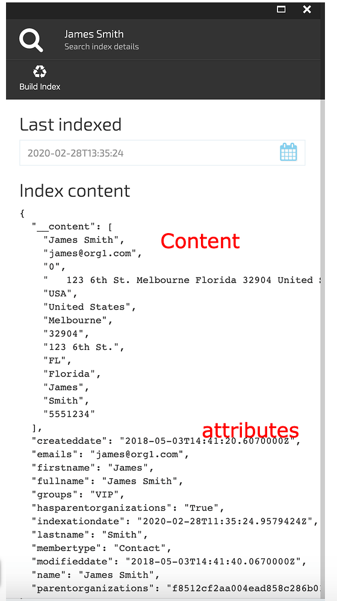
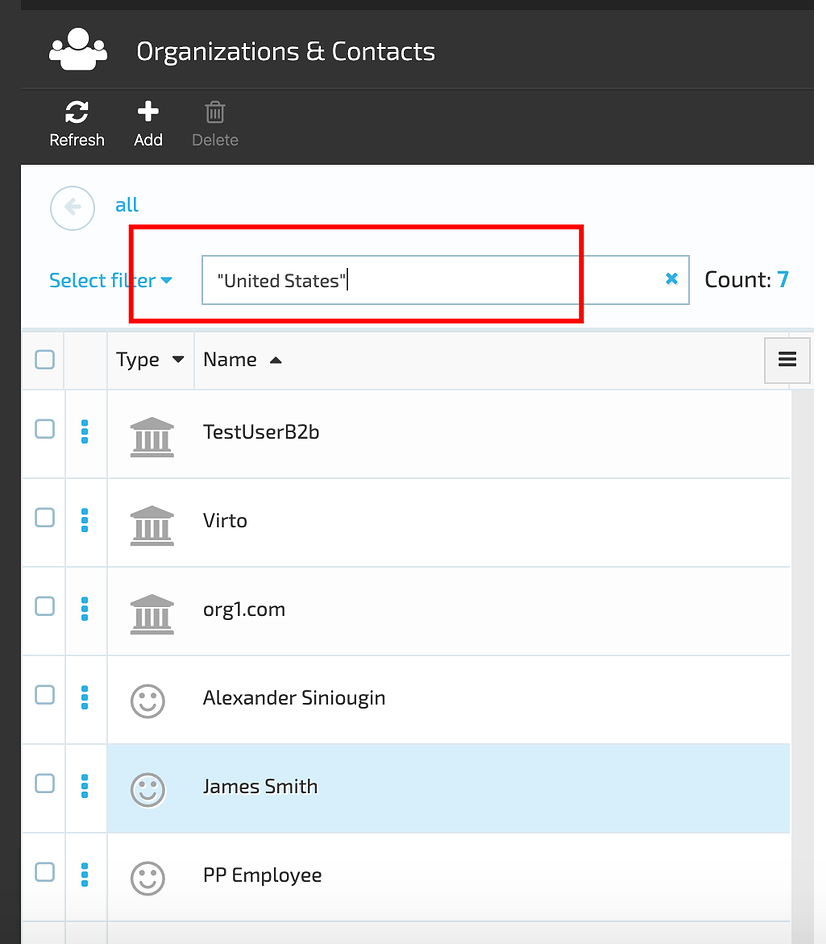
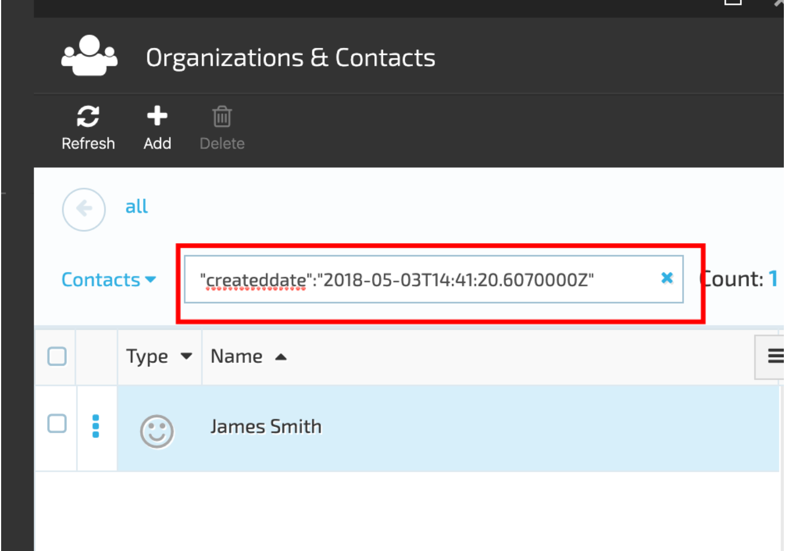

# Advanced Filter

## Default Filters

The  **Advanced Filter** allows the user to filter the Contacts list by the following types:

1. Organizations;
1. Contacts;
1. Vendors.

Selecting the filter type will result in displaying the results that match the filter query accordingly as it's shown bellow on the screenshot:

## Add New Filter

There is also a possibility to add a new filter. In order to do this, you should follow the steps bellow:

1. Select the 'Add new filter' option from the drop down box;
1. In the displayed 'New filter' blade enter the Filter name and the Search phrase;
1. Save & apply the filter;
1. The system will display the filter results based on the filter parameters applied.

## Filter Types

There are two types of filters that can be applied:

1. Filter by content;
1. Filter by index attributes.

### Filter by Content

This type of filter uses the Index content , is case insensitive and supports wildcards.

### Filter by Index Attributes

This type of filter uses the index attributes, is case insensitive and doesn't support wildcards.

#### Example of applying a Content filter

1. Select a Contact-> open Contact details and select the 'Indexed' widget;
1. Select any phrase, word or a part of word followed by the * from the Index Content. Ex, "United States";
1. Enter the selected content into the filter field and press 'Enter';
1. The system will display the results that match the entered content.

#### Example of applying Index Attributes filter

1. Select a Contact-> open Contact details and select the 'Indexed' widget;
1. Select an attribute, ex. "createddate": "2018-05-03T14:41:20.6070000Z" and enter it into the filter field;
1. Press 'Enter'
1. The system will display the results that match the entered index attribute.

