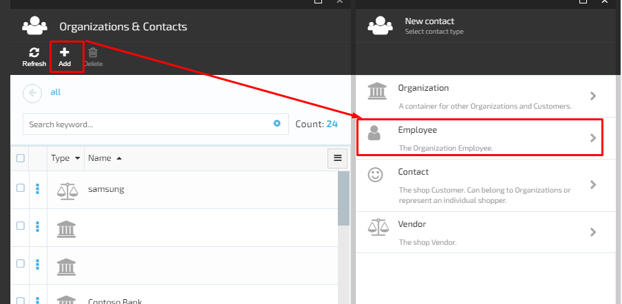
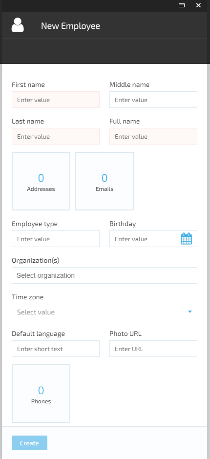
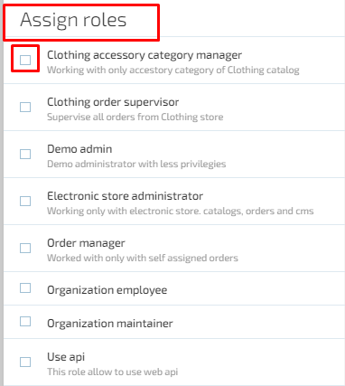
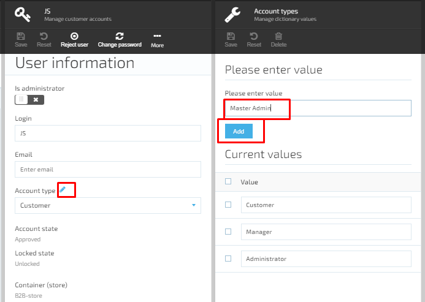
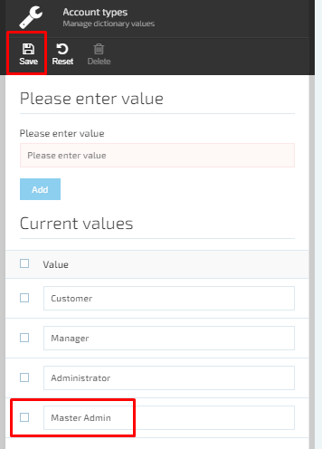
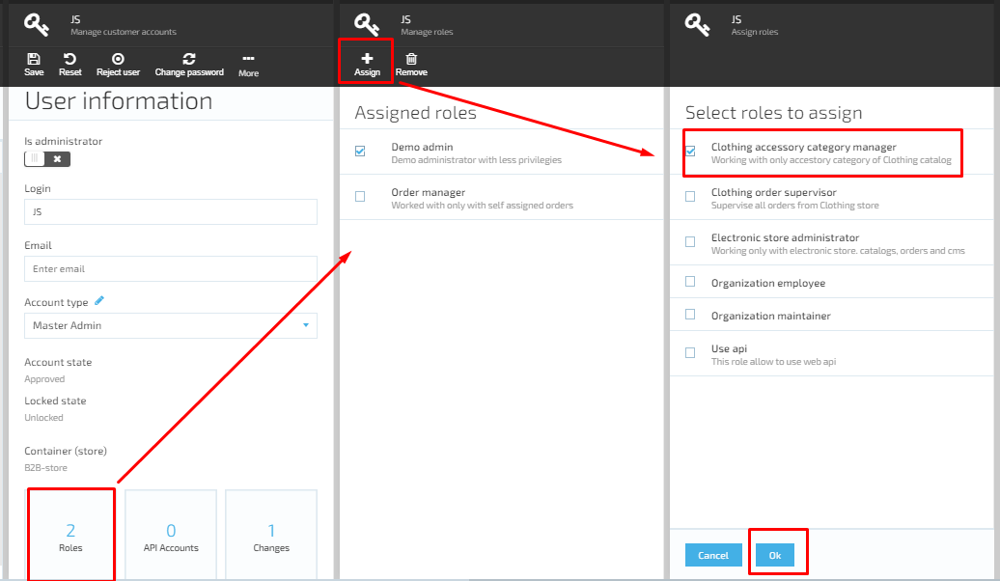
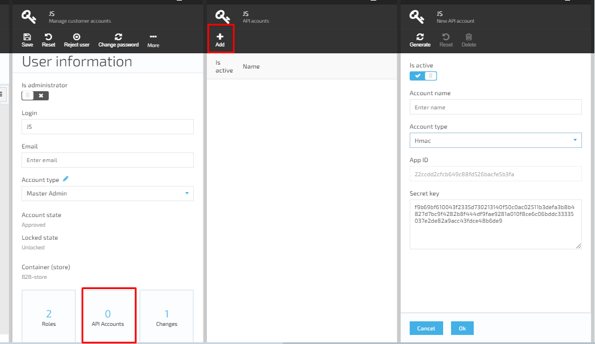

# Manage Employees

## Create New Employee

1. The user opens the Contacts Module ->clicks ‘Add’ and selects ‘Employee’;
1. The system will display the ‘New Employee’ screen:
     1. ‘First name’ filed- required;
     1. ‘Middle name’ screen;
     1. ‘Last name’ field- required;
     1. ‘Full name’ field- required;
     1. Widgets:  
         1. Addresses;
         1. Emails;
         1. Phones.
     1. ‘Employee type’ field;
     1. ‘Birthday- date picker;
     1. ‘Organization(s)’ drop down;
     1. ‘Time zone’ drop down;
     1. ‘Default language’ field;
     1. ‘Photo URL’ field;
     1. ‘Create’ button disabled by default until the required fields are filled out.
1. The user should fill out the form and click the ‘Create’ button;
1. The system will create the new employee and display it on the ‘Contacts’ list.

**Important**: If the Organization was selected, the new Employee will appear on the Organization’s contact list. If no Organization was selected, the new employee will appear on the ‘Organizations & Contacts’ list of the Contacts Module.

## Edit Employee

### Add Account to Employee

1. On ‘Employee details’ screen the user selects the ‘Accounts’ widget;
1. The system will first display the ‘Manage customer accounts’ screen;
     1. If any accounts were added before, they will be displayed on the screen;
     1. The ‘Add’ button is always active;
     1. The ‘Delete’ button is disabled by default and becomes active only when at least one account from the list is selected.  
1. The user clicks the ‘Add’ button;
1. The system will open the ‘New Account’ screen and prompt the user to select a store for the new account. The list of available stores will be displayed on the screen;
1. The user selects the store;
1. The system will open the ‘Manage customer account’ screen and prompt the user to fill out the form:
     1. ‘Login’ field- required;
     1. ‘Email’ field;
     1. ‘Password’ field- required;
     1. ‘Repeat password’ field- required;
     1. ‘Assign roles’ - optional. The user can select the roles to be assigned to the employee using the check boxes; 
     1. ‘Create’ button is disabled by default and becomes active when ALL required fields are filled out;
1. The user fills out the form and clicks the ‘Create’ button;
1. The system will create the new account and display it on ‘Manage customer accounts’ screen. The User information will be displayed on the right side on a separate blade.

### Edit User Information

On User Information screen all fields and widgets are editable.

#### Edit Account Type

1. The user navigates to User Information screen and selects the account type from the drop down list;
1. The system provides three default types :

      1. Customer;
      1. Manager;
      1. Administrator.
1. After selecting the account type, the user saves the changes;
1. The selected account type will be applied to the user.

**Important**: The Customer does not have access to the admin tool. Only Manager and Administrator account types can have access to the admin tool.

#### Add Account Type Value

1. On User Information screen the user should select the ‘Edit’ icon next to the ‘Account type’;
1. The system will display the ‘Manage dictionary values’ screen;
1. The user adds a new Account type and saves the changes;
1. The new account type will appear on the list and will be available for selection on the drop down list.

#### Add/Edit Account Role

1. On ‘User Information’ screen the user selects the ‘Roles’ widget;
1. The system will display the ‘Manage roles’ screen;
1. The user clicks the ‘Assign’ button to either add a new role or edit the existing assigned roles;
1. The system will open the ‘Assign roles’ screen and the list of all roles will be displayed;
1. The user can add a new role and/or remove the assigned one. After clicking the ‘OK’ button the changes will be saved;
1. The system will close the ‘Manage roles’ screen and display the ‘User Information’ screen. The ‘Roles’ widget will display the number of roles assigned after editing.  

#### Add API Accounts

1. On ‘User Information’ screen the user selects the ‘API Accounts’ widget;
1. The system will display the ‘API accounts’ screen. If API accounts were added before, the list of these accounts will be displayed on this screen;
1. The user clicks the ‘Add’ button to add a new API account;
1. In order to edit the existing API account, the user selects the account from the list and clicks on it;
1. The system will display the API account information in editable format;
1. The user makes the editing and saves the changes by clicking the ‘OK’ button;
1. If the user wants to delete the selected API account, he should simply click the ‘Delete’ button and the account will be deleted;
1. In order to add a new API account, the user should click the ‘Add’ button;
1. The system will open the ‘New API account’ form;
1. The user enters the account name, selects the API account type from the drop down list, generate a new secret key and clicks the ‘OK’ button;
1. The system will create a new API account and display it on the list of accounts;
1. The general number of API accounts will be displayed in the widget.

**The ‘Changes’** widget displays the history of changes made to the account  

### Add Address to Employee Details

1. In order to add an address to an account, the user should select the ‘Addresses’ widget;
1. The system will display the edit addresses screen;
1. The user fills out the form and clicks the ‘OK’ button;
1. The new address will be added to the account;
1. The user can add as many addresses as necessary and edit or remove the existing ones;
1. The system will display the general number of addresses in the ‘Addresses’ widget.

### Add Email to Employee Details

1. The user selects the ‘Emails’ widget;
1. The system will display the ‘Manage emails’ screen;
1. The user clicks the ‘Add’ button;
1. The email field will become editable;
1. The user enters the email address into the field and clicks the ‘OK’ button;
1. The system will save the entered email;
1. The user can add as many emails as needed. The general number of emails will be displayed in the Emails widget.

### Add Phones to Employee Details

1. The user selects the Phones widget on ‘Employee details’ screen;
1. The system will open the ‘Manage phones’ screen;
1. The user clicks the ‘Add’ button;
The ‘Enter phone field’ becomes editable;
1. The user enters the phone number and clicks the ‘OK’ button;
1. The system will save the entered phone number. 

### Add Dynamic Properties

See Marketing Module document for details https://github.com/VirtoCommerce/vc-module-marketing