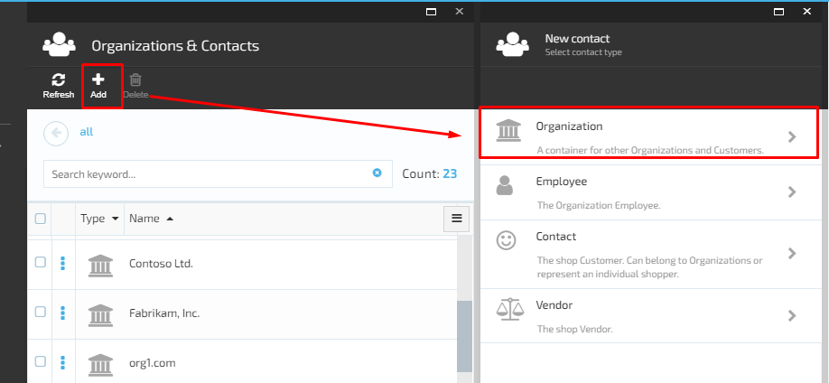
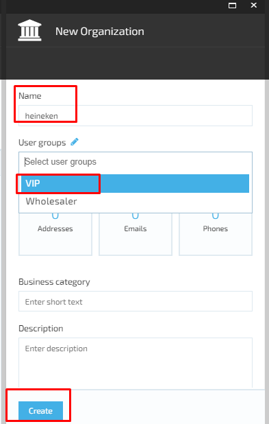
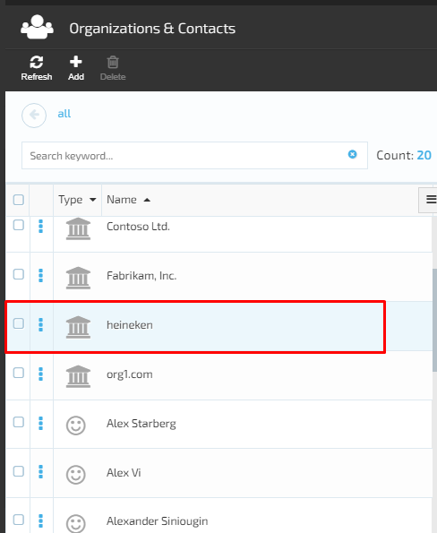
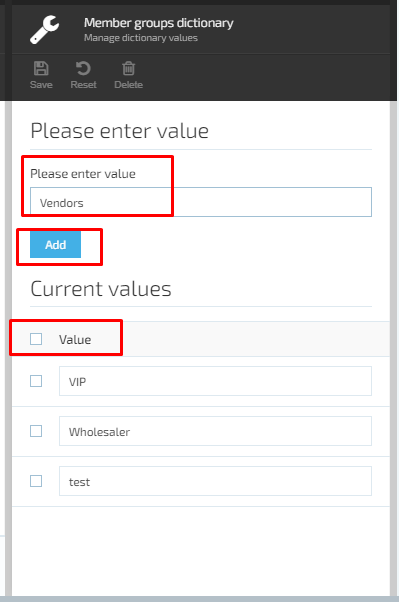
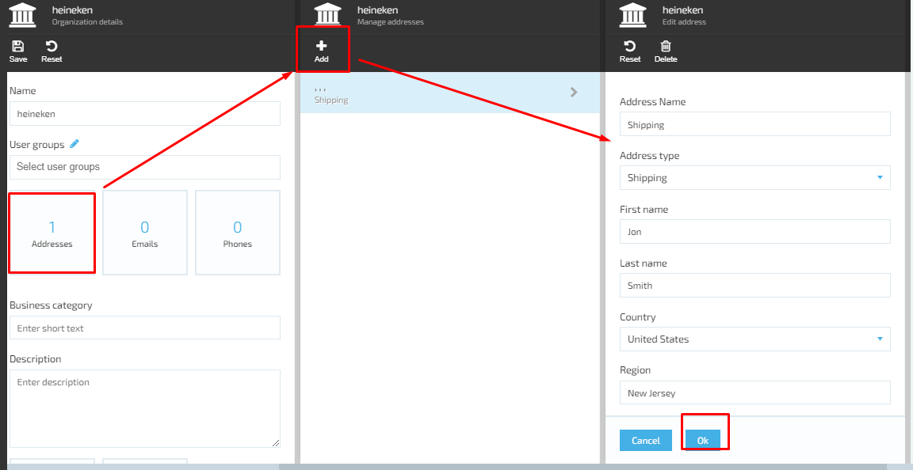
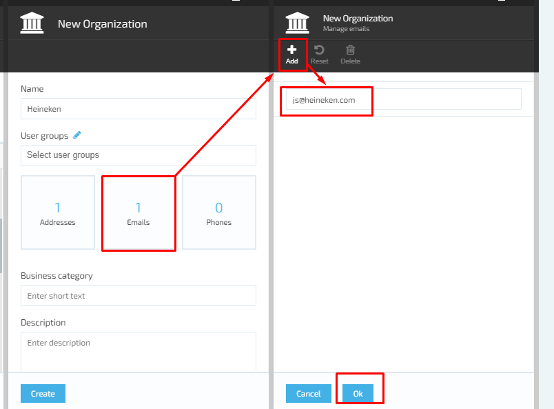
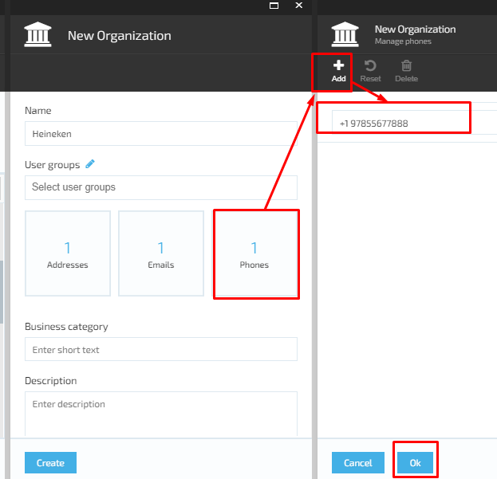

# Manage Organizations 

## Create New Organization

1. The user browses the Contacts Module and clicks the ‘Add’ button;
1. The system will display the ‘New contact’ screen and prompt the user to select the Contact type;
1. The user selects ‘Organization’;
1. The system will open the ‘New Organization’ screen:
     1. ‘Name’ field- required;
     1. ‘User group’ field with possibility to add a new group. Default values:
         1. VIP;
         1. Wholesaler;
     1. Widgets:
         1. Addresses;
         1. Emails;
         1. Phones.
     1. ‘Business category’ field;
     1. ‘Description’ text box;
     1. ‘Create’ button remains disabled until the required fields are filled out.  
1. The user fills out the fields and widgets displayed on the screen and clicks the ‘Create’ button;
1. The system will create the new Organization and display it on the list of contacts.  

## Edit Organization

### Add User Group to the Organization

1. The user clicks the ‘Edit’ icon for the ‘User Groups’;
1. The system will open the ‘Member groups dictionary’ screen (Manage dictionary values):  
     1. ‘Please enter value’ field- required;
     1. ‘Add’ button disabled by default until the required filled is filled out.
1. List of current values followed by check boxes and possibility to select a value;
1. The user enters the name of the new value and clicks the ‘Add’ button;
1. The new value will be added and displayed on the list;
1. The user saves the changes and the new value will be displayed in the drop down list under ‘User groups’.

### Add Address to the Organization

1. The user selects the ‘Addresses’ widget on the ‘New Organization’ screen;
1. The system will open the ‘Edit address’ screen:
     1. ‘Address name’ field;
     1. ‘Address type’ drop down;
     1. Billing;
     1. Shipping;
     1. Billing& Shipping;
     1. ‘First name’ field- required;
     1. ‘Last name’ field- required;
     1. ‘Country’ drop down- required;
     1. ‘Region’ field- required;
     1. ‘City’ field- required;
     1. ‘Address line 1’ field- required;
     1. ‘Address line 2’ field;
     1. ‘Zip code’ field – required;
     1. ‘Email’ field;
     1. ‘Phone’ field;
     1. ‘Cancel’/ ‘OK’ buttons.
1. The user fills out the form and clicks the ‘OK’ button;
1. The system will add the new address that will appear on the list of Organization addresses.  

### Add Email Address to the Organization

1. The user selects the ‘Emails’ widget on ‘New Organization’ screen and clicks ‘Add’;
1. The system will display the required email input text field;
1. The user enters the email address and clicks ‘OK’;
1. The system will add the entered email and display it on the ‘Manage emails’ screen.

### Add Phone Number to the Organization

1. The user selects the ‘Phones’ widget on ‘New Organization’ screen and clicks ‘Add’;
1. The system will display the required email input text field;
1. The user enters the phone number and clicks ‘OK’;
1. The system will add the entered phone and display it on the ‘Manage phones ’screen.

