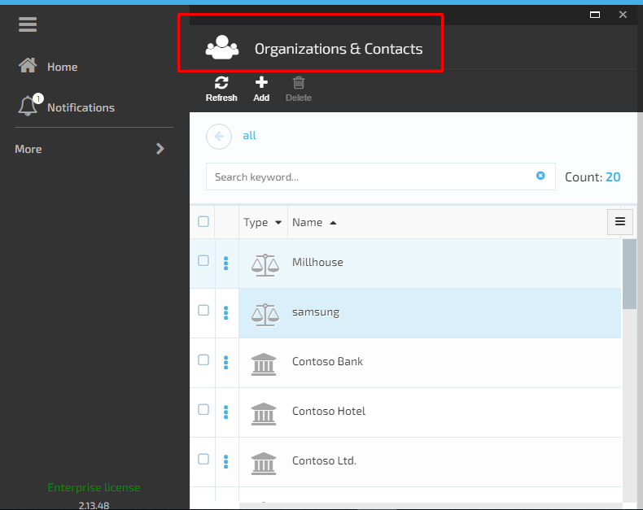

# Overview

    

VirtoCommerce.Customer module represents contacts management system. The main purpose of this functionality is to keep the users contact information. The VC Customer Module helps to view, search and edit contact information.

## Key features:

1. Сontacts arrangement in hierarchical structure;
1. Module extensibility with custom contact types;
1. "Organization", "Employee", "Customer" and "Vendor" contact types supported out of the box.

 **Contact Types**:

1. Organization;
1. Employee;
1. Contact;
1. Vendor.

## Organization

Organization contact type is a container for other Organizations and Customers.

1. [View Organization Details](/docs/view-organization-details.md)

1. [Create And Manage Organization](/docs/create-and-manage-organization.md)

## Employee

Employee contact type means the Organization Employee.

[Create And Manage Employee](/docs/create-and-manage-employee.md)

## Contact

 A Contact is the Shop customer. It can belong to Organizations or represent an individual shopper.

[Create And Manage Contacts](/docs/manage-contacts.md)

## Vendor

Vendor contact type is the Shop Vendor.

[Create And Manage Vendors](/docs/manage-vendors.md)

## Advanced Filter

[Advanced Filter](/docs/advanced-filter.md)
