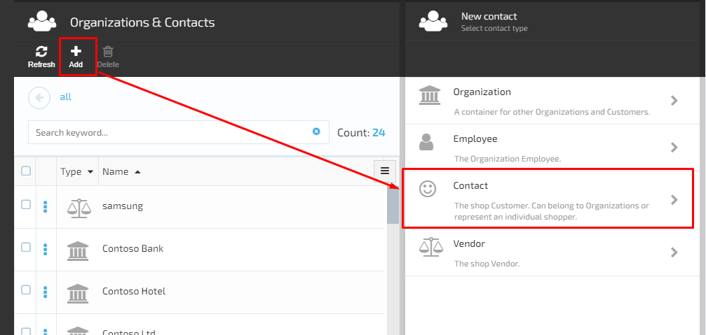
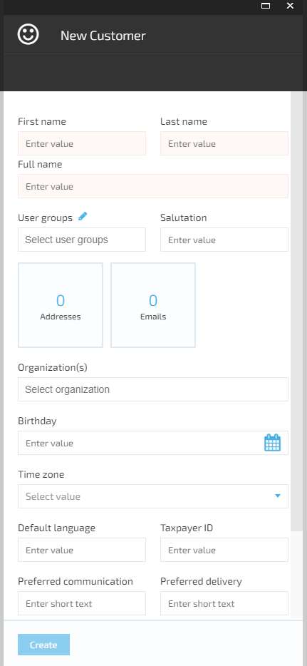
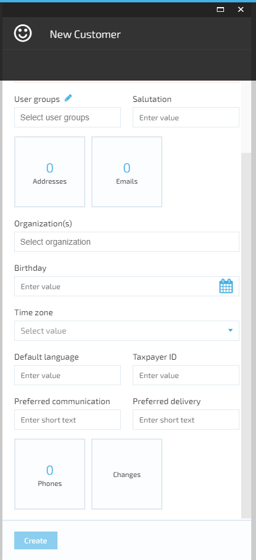

# Manage Contacts

## Add A New Contact

1. The user browses the Contacts Module-> clicks ‘Add’ and selects ‘Contact’;
1. The system will open the ‘New Customer screen that displays the following fields and widgets:  
     1. First name field- required;
     1. Last name field- required;
     1. Full name field- required;
     1. User groups drop down. The user can select one of the options available or add a new user group;
     1. Salutation field;
     1. Organizations drop down;
     1. Birthday date picker;
     1. Time zone drop down;
     1. Default language field;
     1. Taxpayer ID;
     1. Preferred communication;
     1. Preferred delivery;
     1. Widgets:
         1. Addresses;
         1. Emails;
         1. Phones;
         1. Changes.
     1. ‘Create’ button disabled by default.  
1. The user fills out the form and clicks the ‘Create’ button, which becomes active when all required fields are filled out;
1. The system will create the new Contact;  
1. If the customer belongs to an Organization, his name will be displayed inside the Organization;
1. If the customer does not belong to any Organization, his name will be displayed on the Contacts & Organizations list when the Contacts Module is browsed.  

## Edit Contact Details

1. The user opens the Contacts Module and selects the Contact;  
1. The system will open the Contact details in editable format;  
      1. All fields and widgets are editable;
      1. The system displays additional widgets:
            1. Accounts;
            1. Dynamic properties;
            1. Changes;
            1. Indexing.
1. The user makes the editing and saves the changes;
1. The system will save the changes and display the updated Contact.
