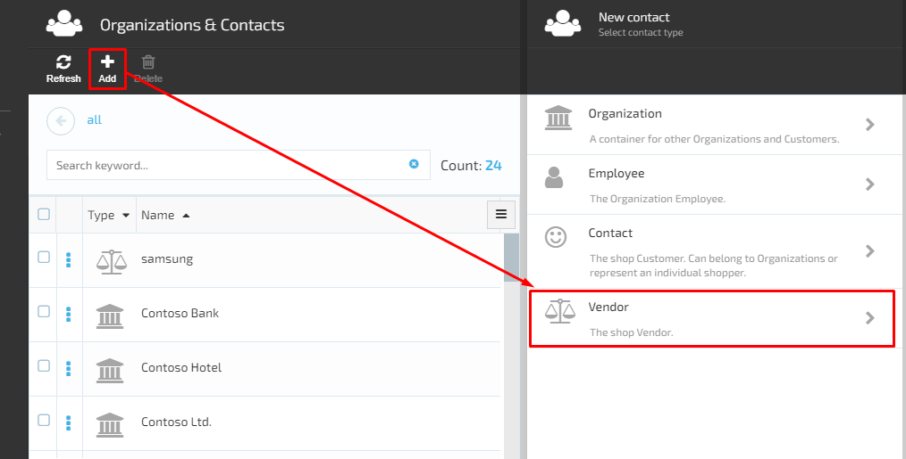
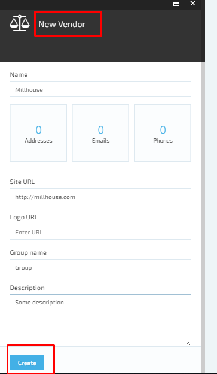
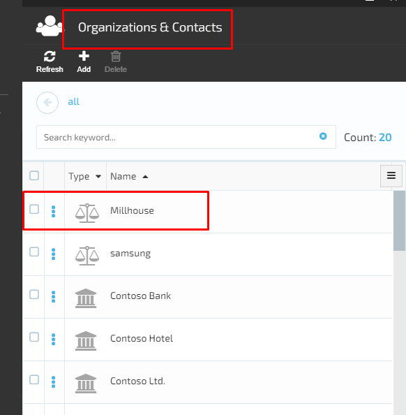
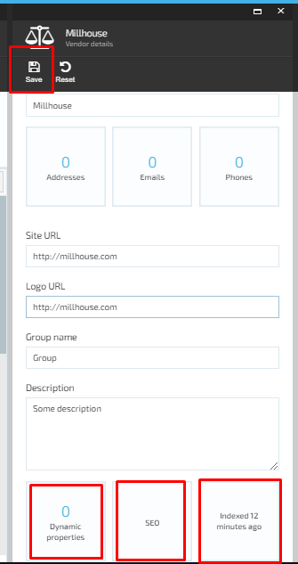

# Create And Manage Vendors

## Add New Vendor

1. The user opens the Contacts Module->clicks ‘Add’ and selects ‘Vendor’;
1. The system will open the ‘New Vendor’ screen and the following fields and widgets will be displayed:  
     1. ‘Name’ field- required;
     1. ‘Site URL’ field;
     1. ‘Logo URL’ field;
     1. ‘Group name’ field;
     1. ‘Description’ text box;
     1. Widgets:
         1. Addresses;
         1. Emails;
         1. Phones;
     1. ‘Create’ button is disabled by default.
1. The user fills out the form and clicks the ‘Create’ button;
1. The system will create the new Vendor and display it on the list of Contacts& Organizations;

## Edit vendor Details

1. The user selects the Vendor from the Organizations & Contacts list and clicks the ‘Manage’ button;
1. The system will display the ‘Vendor details’ screen:  
     1. All fields and widgets are editable;
     1. Additional widgets appear on Vendor details screen:  
         1. Dynamic properties;
         1. SEO;
         1. Indexing.
1. The user makes the editing and saves the changes;
1. The system will save the changes and display the updated Vendor details.

