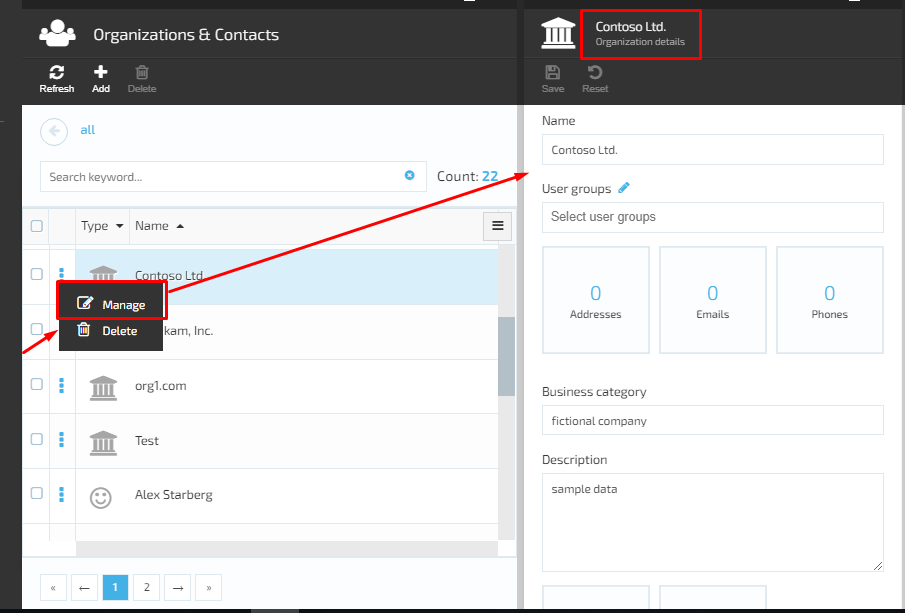
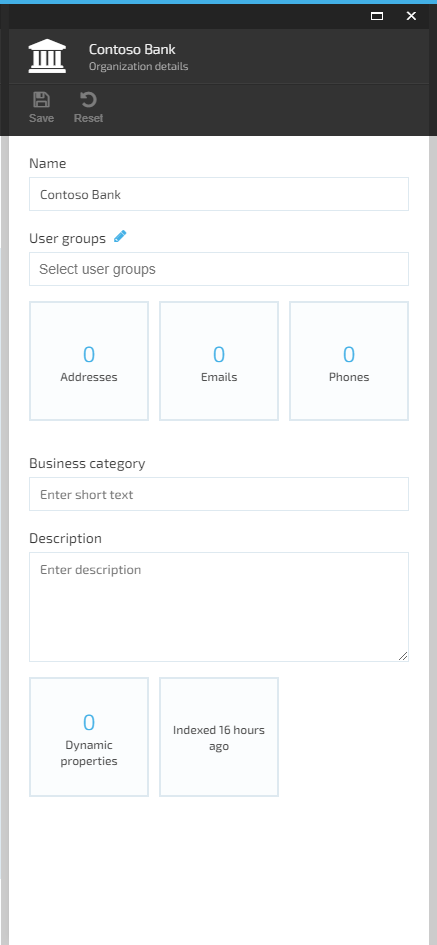

# View Organization Details

1. The user browses the Contacts Module -> selects an Organization from the displayed list of contacts and clicks the ‘Manage’ option under the three dots located on the left side of the Organization name;
1. The system will open the Organization details screen that displays the following:
     1. ‘Name’ field;
     1. ‘User groups’ field with possibility to add/edit the user group;
     1. Widgets:
         1. Addresses;
         1. Emails;
         1. Phones;
     1. ‘Business category’ field;
     1. ‘Description’ text box;
     1. Additional widgets that do not belong to the Contacts Module, but integrated with it:
         1. Dynamic properties;
         1. Search Index;

